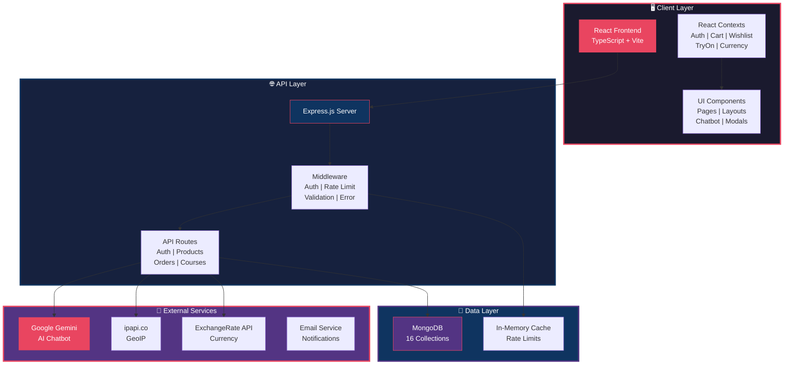
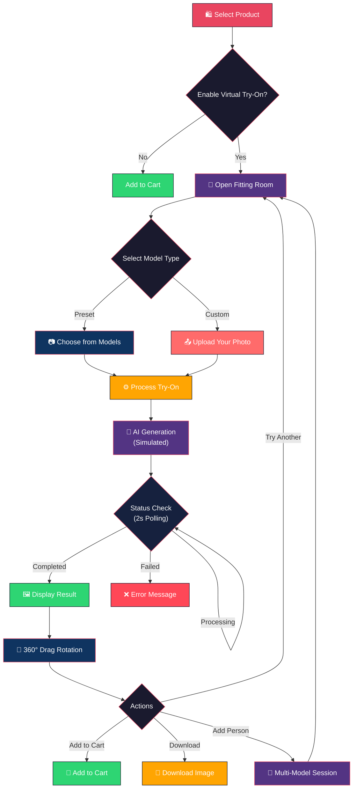
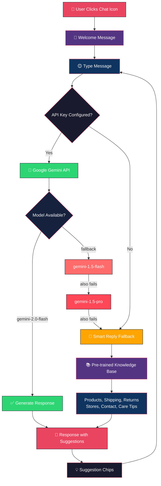
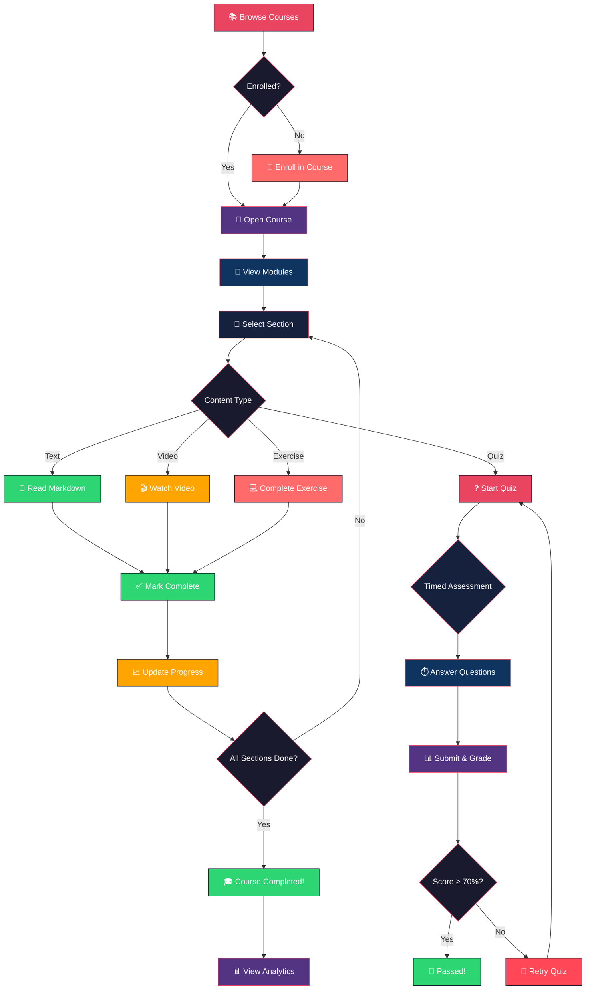
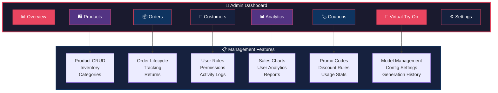
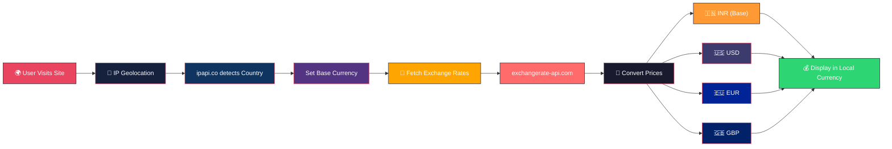

# 🏛️ BSC Exclusive — Full-Stack E-Commerce & Learning Platform

> **Established 1938** — BS Channabasappa | Premium Indian Handloom Silk Sarees & Ethnic Wear

A comprehensive full-stack e-commerce and learning management platform for BS Channabasappa, combining luxury retail for silk sarees, kurtas, and ethnic wear with a textile education LMS. Features AI-powered virtual try-on, chatbot assistance, multi-currency support, and a complete admin dashboard.

---

## 📑 Table of Contents

- [Project Overview](#-project-overview)
- [Tech Stack](#-tech-stack)
- [Architecture & System Flow](#-architecture--system-flow)
- [Features](#-features)
- [Database Models](#-database-models)
- [API Endpoints](#-api-endpoints)
- [Frontend Pages](#-frontend-pages)
- [Authentication & Authorization](#-authentication--authorization)
- [Getting Started](#-getting-started)
- [Environment Variables](#-environment-variables)
- [Project Structure](#-project-structure)
- [Security](#-security)
- [Contributing](#-contributing)
- [License](#-license)

---

## 📌 Project Overview

| Detail | Description |
|--------|-------------|
| **Project Name** | BSC Exclusive |
| **Brand** | BS Channabasappa (Est. 1938) |
| **Type** | Full-Stack E-Commerce + LMS |
| **Industry** | Premium Indian Handloom Silk Sarees & Ethnic Wear |
| **Users** | Customers, Admins, Instructors |

### Core Modules

| Module | Description |
|--------|-------------|
| 🛍️ **E-Commerce Store** | Product catalog, cart, checkout, orders, coupons, multi-currency |
| 📚 **Learning Management** | Courses, modules, sections, quizzes, progress tracking |
| 🤖 **AI Chatbot** | Gemini-powered customer support with smart fallbacks |
| 👗 **Virtual Try-On** | AI fitting room with multi-model support & 360° rotation |
| 📊 **Admin Dashboard** | Products, orders, customers, analytics, marketing tools |
| 👤 **Customer Dashboard** | Orders, wishlist, addresses, profile settings |

---

## 🛠️ Tech Stack

### Frontend

| Technology | Version | Purpose |
|------------|---------|---------|
| React | 19.2.6 | UI Library |
| TypeScript | ~6.0.2 | Type Safety |
| Vite | 8.0.12 | Build Tool & Dev Server |
| React Router DOM | 7.16.0 | Client-Side Routing |
| Axios | 1.20.0 | HTTP Client |
| React-Leaflet | 5.0.0 | Maps (Store Locator) |
| Lucide React | 1.17.0 | Icon Library |

### Backend

| Technology | Version | Purpose |
|------------|---------|---------|
| Node.js | ES Modules | Runtime |
| Express.js | 4.21.0 | Web Framework |
| Mongoose | 8.6.0 | MongoDB ODM |
| JSON Web Tokens | 9.0.2 | Authentication |
| bcryptjs | 2.4.3 | Password Hashing |
| express-validator | 7.2.0 | Input Validation |
| express-rate-limit | 7.4.0 | Rate Limiting |
| Helmet | 7.1.0 | Security Headers |
| Morgan | 1.10.0 | HTTP Logging |

### Database & External Services

| Service | Purpose |
|---------|---------|
| MongoDB | Primary Database |
| Google Gemini API | AI Chatbot & Virtual Try-On |
| ipapi.co | GeoIP Currency Detection |
| exchangerate-api.com | Live Exchange Rates |
| Docker | MongoDB Container |

---

## 🔄 Architecture & System Flow

### High-Level Architecture



### Authentication Flow

```mermaid
sequenceDiagram
    autonumber
    participant U as 👤 User
    participant F as 🖥️ Frontend
    participant A as 🔐 Auth API
    participant DB as 💾 MongoDB
    participant JWT as 🎫 Token

    rect rgb(26, 26, 46)
    Note over U,JWT: Registration Flow
    U->>F: Fill Registration Form
    F->>A: POST /api/auth/register
    A->>A: Validate Input (express-validator)
    A->>A: Hash Password (bcrypt 12 rounds)
    A->>DB: Create User Document
    DB-->>A: User Created
    A->>JWT: Generate JWT (7-day expiry)
    JWT-->>A: Token Created
    A-->>F: { user, token }
    F->>F: Store Token in localStorage
    F-->>U: Redirect to Dashboard
    end

    rect rgb(15, 52, 96)
    Note over U,JWT: Login Flow
    U->>F: Enter Email + Password
    F->>A: POST /api/auth/login
    A->>DB: Find User by Email
    DB-->>A: User Document
    A->>A: Compare Password (bcrypt)
    A->>DB: Update lastLogin
    A->>JWT: Generate JWT
    JWT-->>A: Token Created
    A-->>F: { user, token }
    F->>F: Store Token + Login Timestamp
    F-->>U: Redirect to Dashboard
    end

    rect rgb(83, 52, 131)
    Note over U,JWT: Protected Request Flow
    U->>F: Access Protected Page
    F->>F: Check 24hr Client Expiry
    F->>A: GET /api/resource
    Note right of F: Header: Authorization: Bearer token
    A->>JWT: Verify Token
    JWT-->>A: Decoded User
    A->>DB: Load User from DB
    A->>A: Check Role Permission
    A-->>F: Protected Data
    F-->>U: Render Page
    end
```



### E-Commerce Order Flow

```mermaid
flowchart LR
    A["🛒 Browse Products"] --> B["➕ Add to Cart"]
    B --> C["📋 Review Cart"]
    C --> D{"Apply Coupon?"}
    D -->|Yes| E["🏷️ Enter Code"]
    D -->|No| F["💳 Checkout"]
    E --> F
    F --> G["📍 Select Address"]
    G --> H["🚚 Choose Shipping"]
    H --> I["💰 Payment"]
    I --> J{"Payment Method"}
    J -->|COD| K["✅ Order Placed"]
    J -->|Card/UPI| L["🔒 Payment Gateway"]
    L --> M{"Payment OK?"}
    M -->|Yes| K
    M -->|No| N["❌ Payment Failed"]
    K --> O["📧 Confirmation Email"]
    O --> P["📦 Processing"]
    P --> Q["🚚 Shipped"]
    Q --> R["📍 Out for Delivery"]
    R --> S["✅ Delivered"]

    style A fill:#e94560,stroke:#1a1a2e,color:#ffffff
    style B fill:#ff6b6b,stroke:#1a1a2e,color:#ffffff
    style C fill:#ffa502,stroke:#1a1a2e,color:#ffffff
    style D fill:#1a1a2e,stroke:#e94560,color:#ffffff
    style E fill:#ff6b6b,stroke:#1a1a2e,color:#ffffff
    style F fill:#533483,stroke:#e94560,color:#ffffff
    style G fill:#0f3460,stroke:#e94560,color:#ffffff
    style H fill:#16213e,stroke:#e94560,color:#ffffff
    style I fill:#e94560,stroke:#1a1a2e,color:#ffffff
    style J fill:#1a1a2e,stroke:#e94560,color:#ffffff
    style K fill:#2ed573,stroke:#1a1a2e,color:#ffffff
    style L fill:#533483,stroke:#e94560,color:#ffffff
    style M fill:#1a1a2e,stroke:#e94560,color:#ffffff
    style N fill:#ff4757,stroke:#1a1a2e,color:#ffffff
    style O fill:#0f3460,stroke:#e94560,color:#ffffff
    style P fill:#16213e,stroke:#e94560,color:#ffffff
    style Q fill:#ffa502,stroke:#1a1a2e,color:#ffffff
    style R fill:#ff6b6b,stroke:#1a1a2e,color:#ffffff
    style S fill:#2ed573,stroke:#1a1a2e,color:#ffffff
```



### Virtual Try-On System Flow



### AI Chatbot Flow



### Learning Management System Flow



### Admin Dashboard Architecture



### Multi-Currency Flow



---

## ✨ Features

### 🛍️ E-Commerce Features

| Feature | Description |
|---------|-------------|
| Product Catalog | Full catalog with categories (Men, Women, Kids), new arrivals, bestsellers |
| Product Details | Images, ratings, reviews, size guides, virtual try-on |
| Shopping Cart | Per-user localStorage persistence (email-keyed) |
| Checkout Flow | Address selection, shipping options, payment methods |
| Wishlist | Per-user persistent wishlist |
| Multi-Currency | Auto-detect via IP, real-time exchange rates, INR default |
| Coupon System | Percentage, fixed, free-shipping, buy-x-get-y promotions |
| Category Filtering | Search, category, difficulty filters |
| Product Badges | New, Bestseller, Sale indicators |
| Shop by Occasion | Wedding, festive, party, casual, office, traditional filtering |
| Age Group Targeting | Teens, young-adults, adults, mature-adults, seniors |

### 👗 Virtual Try-On (AI-Powered)

| Feature | Description |
|---------|-------------|
| Interactive Fitting Room | Full-screen three-panel UI |
| Multi-Model Support | Add/remove/switch between multiple "people" |
| Preset Models | Gender-based auto-matching to products |
| Custom Photo Upload | JPEG/PNG/WebP, max 10MB validation |
| 360° Drag Rotation | Rotate try-on results interactively |
| Product Suggestions | Within fitting room interface |
| Background Polling | 2-second intervals, 60-second timeout |
| Admin Management | Stats, config, model CRUD, generation history |

### 🤖 AI Chatbot

| Feature | Description |
|---------|-------------|
| Floating Widget | Typing indicators, suggestion chips |
| Gemini Integration | 3-model fallback chain (2.0-flash → 1.5-flash → 1.5-pro) |
| Smart Fallback | Pre-trained on store knowledge when no API key |
| Conversation History | Last 8 messages sliding window |
| Suggestion Chips | Common queries for quick access |

### 📚 Learning Management System

| Feature | Description |
|---------|-------------|
| Course Browsing | Published courses with search/filter |
| Hierarchical Content | Course → Module → Section |
| Content Types | Text (Markdown), Video, Quiz, Exercise |
| Progress Tracking | Section completion with percentage |
| Quiz System | Timed assessments, scoring, pass/fail, explanations |
| Activity Logging | Course opened, section completed, quiz passed |
| Analytics | Courses enrolled/completed, avg progress, quiz stats |

### 🔐 Security Features

| Feature | Description |
|---------|-------------|
| JWT Authentication | 7-day expiry, bcrypt password hashing |
| Rate Limiting | 200 req/15min global, 5 req/15min on login |
| DevTools Protection | Blocks F12, Ctrl+Shift+I, right-click |
| Input Validation | express-validator on all endpoints |
| NoSQL Injection Prevention | express-mongo-sanitize |
| Security Headers | Helmet middleware |
| CORS | Configurable allowed origins |
| Cookie Consent | GDPR-style consent banner |

---

## 💾 Database Models

### User Model

```javascript
{
  name: String,        // Required, max 100
  email: String,       // Required, unique, lowercase
  password: String,    // Required, min 6, hashed (never returned)
  phone: String,
  role: Enum,          // 'user' | 'admin' | 'instructor'
  avatar: String,
  bio: String,         // Max 500
  lastLogin: Date
}
```

### Product Model

```javascript
{
  name: String,
  slug: String,            // Auto-generated
  description: String,
  price: Number,
  comparePrice: Number,
  costPrice: Number,
  category: Enum,         // 'men' | 'women' | 'kids'
  subcategory: String,
  images: [{
    url: String,
    alt: String,
    isPrimary: Boolean
  }],
  inventory: {
    quantity: Number,
    lowStockThreshold: Number,
    trackQuantity: Boolean
  },
  variants: [{
    name: String,
    options: [{ name, priceAdjustment, sku, inventory }]
  }],
  rating: {
    average: Number,
    count: Number,
    distribution: { 1-5: Number }
  },
  isActive: Boolean,
  isFeatured: Boolean,
  isNew: Boolean,
  isBestseller: Boolean,
  isSale: Boolean,
  virtualTryOn: Boolean,
  garmentType: Enum,
  ageGroups: [String]
}
```

### Order Model

```javascript
{
  orderNumber: String,     // Auto: BSCyymmddXXXXXX
  user: ObjectId,
  status: Enum,           // pending → confirmed → processing → shipped → delivered
  paymentStatus: Enum,    // pending | paid | failed | refunded
  paymentMethod: Enum,    // cod | card | upi | netbanking | wallet
  items: [{
    product: ObjectId,
    productSnapshot: { name, images, variant },
    quantity: Number,
    price: Number,
    total: Number
  }],
  subtotal: Number,
  shippingCost: Number,
  tax: Number,
  discount: Number,
  total: Number,
  currency: String,       // Default: INR
  shippingAddress: Object,
  tracking: {
    carrier: String,
    trackingNumber: String,
    events: [Object]
  }
}
```

### Course Model

```javascript
{
  title: String,
  description: String,
  thumbnail: String,
  category: String,
  difficulty: Enum,       // 'beginner' | 'intermediate' | 'advanced'
  estimatedDuration: String,
  instructor: String,
  status: Enum,           // 'draft' | 'published' | 'archived'
  enrollmentCount: Number,
  tags: [String],
  createdBy: ObjectId     // Ref: User
}
```

### All 16 Models

| Model | Purpose |
|-------|---------|
| User | User accounts & authentication |
| Product | E-commerce products |
| Cart | Shopping cart (per-user) |
| Order | Order management |
| Review | Product reviews & ratings |
| Category | Product categories (hierarchical) |
| Coupon | Promotional codes |
| Address | User addresses |
| Course | LMS courses |
| Module | Course modules |
| Section | Course sections |
| Quiz | Course quizzes |
| QuizAttempt | Quiz submissions & scores |
| Progress | User course progress |
| Activity | User activity logging |
| TryOnConfig | Virtual try-on configuration |
| TryOnModel | Preset try-on models |
| TryOnGeneration | Try-on generation history |

---

## 🌐 API Endpoints

### Authentication

| Method | Endpoint | Auth | Description |
|--------|----------|------|-------------|
| POST | `/api/auth/register` | Public | Register new user |
| POST | `/api/auth/login` | Public | Login (rate-limited: 5/15min) |
| GET | `/api/auth/me` | Protected | Get current user |

### Products & Orders

| Method | Endpoint | Auth | Description |
|--------|----------|------|-------------|
| GET | `/api/products` | Public | List products (paginated) |
| GET | `/api/products/:id` | Public | Get product details |
| POST | `/api/cart` | Protected | Add to cart |
| PUT | `/api/cart/:id` | Protected | Update cart item |
| DELETE | `/api/cart/:id` | Protected | Remove from cart |
| POST | `/api/orders` | Protected | Create order |
| GET | `/api/orders` | Protected | Get user orders |
| GET | `/api/orders/:id` | Protected | Get order details |

### Courses & Learning

| Method | Endpoint | Auth | Description |
|--------|----------|------|-------------|
| GET | `/api/courses` | Protected | List courses (paginated) |
| GET | `/api/courses/:id` | Protected | Get course with modules |
| POST | `/api/courses` | Admin | Create course |
| PUT | `/api/courses/:id` | Admin | Update course |
| GET | `/api/learning/:courseId` | Protected | Get course content |
| POST | `/api/progress/section/:id/complete` | Protected | Mark section complete |
| GET | `/api/quiz/:quizId` | Protected | Get quiz |
| POST | `/api/quiz/:quizId/submit` | Protected | Submit quiz answers |

### Virtual Try-On

| Method | Endpoint | Auth | Description |
|--------|----------|------|-------------|
| GET | `/api/try-on/config` | Public | Get try-on config |
| GET | `/api/try-on/models` | Public | Get active models |
| POST | `/api/try-on/generate` | Optional | Generate try-on |
| GET | `/api/try-on/history` | Protected | Get generation history |
| GET | `/api/try-on/admin/stats` | Admin | Admin statistics |
| POST | `/api/try-on/admin/models` | Admin | Create model |
| PUT | `/api/try-on/admin/models/:id` | Admin | Update model |
| DELETE | `/api/try-on/admin/models/:id` | Admin | Delete model |

### Admin Management

| Method | Endpoint | Auth | Description |
|--------|----------|------|-------------|
| GET | `/api/users` | Admin | List all users |
| DELETE | `/api/users/:id` | Admin | Delete user |
| GET | `/api/analytics/user` | Protected | User analytics |
| GET | `/api/analytics/admin` | Admin | Admin analytics |
| GET | `/api/try-on/admin/generations` | Admin | Generation logs |

---

## 🖥️ Frontend Pages

### Public Pages

| Route | Page | Description |
|-------|------|-------------|
| `/` | LandingPage | Hero carousel, featured products, collections, testimonials |
| `/shop` | ShopPage | Product listing with filters |
| `/category/:id` | CategoryPage | Category-filtered products |
| `/product/:id` | ProductDetails | Product detail with try-on |
| `/login` | Login | User login form |
| `/register` | Register | User registration form |
| `/cart` | CartPage | Shopping cart |
| `/checkout` | CheckoutPage | Checkout flow |
| `/customer-service` | CustomerService | Contact & support |

### Customer Dashboard

| Route | Page | Description |
|-------|------|-------------|
| `/dashboard` | CustomerDashboard | Overview |
| `/dashboard/orders` | CustomerOrders | Order history |
| `/dashboard/orders/:id` | OrderDetails | Single order detail |
| `/dashboard/wishlist` | CustomerWishlist | Wishlist management |
| `/dashboard/addresses` | CustomerAddresses | Address book |
| `/dashboard/settings` | CustomerSettings | Profile settings |

### Admin Dashboard

| Route | Page | Description |
|-------|------|-------------|
| `/admin/overview` | Overview | Dashboard overview |
| `/admin/products` | Products | Product management |
| `/admin/products/new` | NewProduct | Create product |
| `/admin/orders` | Orders | Order management |
| `/admin/customers` | Customers | Customer management |
| `/admin/analytics` | Analytics | Analytics dashboard |
| `/admin/coupons` | Coupons | Coupon management |
| `/admin/try-on` | TryOnOverview | Try-on system overview |
| `/admin/try-on/models` | TryOnModels | Manage models |
| `/admin/try-on/settings` | TryOnSettings | Try-on config |
| `/admin/try-on/history` | TryOnHistory | Generation logs |
| `/admin/settings` | Settings | Admin settings |

---

## 🔐 Authentication & Authorization

### Role Hierarchy


### Permissions Matrix

| Feature | Guest | User | Admin | Instructor |
|---------|-------|------|-------|------------|
| Browse Products | ✅ | ✅ | ✅ | ✅ |
| Add to Cart | ❌ | ✅ | ✅ | ✅ |
| Place Order | ❌ | ✅ | ✅ | ✅ |
| View Dashboard | ❌ | ✅ | ✅ | ✅ |
| Virtual Try-On | ⚠️* | ✅ | ✅ | ✅ |
| Create Courses | ❌ | ❌ | ✅ | ✅ |
| Manage Products | ❌ | ❌ | ✅ | ❌ |
| Manage Users | ❌ | ❌ | ✅ | ❌ |
| View Analytics | ❌ | Basic | ✅ | ✅ |

*Guest access configurable via admin settings

---

## 🚀 Getting Started

### Prerequisites

- Node.js (v18+)
- MongoDB (local or Docker)
- npm or yarn

### Installation

```bash
# Clone the repository
git clone https://github.com/GaganCB2002/bsc.git
cd bschannabasappa

# Install backend dependencies
cd backend
npm install

# Install frontend dependencies
cd ../frontend
npm install
```

### Database Setup (Docker)

```bash
cd database
docker-compose up -d
```

### Environment Variables

```bash
# Backend .env
cp backend/.env.example backend/.env

# Edit backend/.env
MONGODB_URI=mongodb://localhost:27017/bsc-exclusive
JWT_SECRET=your-super-secret-jwt-key-min-32-chars
JWT_EXPIRE=7d
NODE_ENV=development
PORT=5000
GEMINI_API_KEY=your-google-gemini-api-key
ALLOWED_ORIGINS=http://localhost:5173
EXPOSE_STACK=1
```

### Seed Database

```bash
cd backend
node seed/seedData.js
```

### Run Development Servers

```bash
# Terminal 1 - Backend
cd backend
npm run dev

# Terminal 2 - Frontend
cd frontend
npm run dev
```

### Default Users (After Seeding)

| Role | Email | Password |
|------|-------|----------|
| Admin | admin@bsc.com | admin123 |
| User | user@bsc.com | user123 |

---

## 📁 Project Structure

```
bschannabasappa/
├── package.json                    # Root workspace scripts
├── README.md                       # This file
├── SECURITY.md                     # Security notes
├── database/
│   └── docker-compose.yml          # MongoDB container
├── backend/
│   ├── package.json                # Backend dependencies
│   ├── app.js                      # Express app config
│   ├── server.js                   # Server bootstrap
│   ├── config/
│   │   └── db.js                   # MongoDB connection
│   ├── controllers/                # 8 controller files
│   │   ├── authController.js
│   │   ├── courseController.js
│   │   ├── learningController.js
│   │   ├── progressController.js
│   │   ├── quizController.js
│   │   ├── userController.js
│   │   ├── analyticsController.js
│   │   └── tryOnController.js
│   ├── middleware/                  # 8 middleware files
│   │   ├── auth.js
│   │   ├── errorHandler.js
│   │   ├── rateLimiter.js
│   │   ├── asyncHandler.js
│   │   ├── requestId.js
│   │   ├── safeActivity.js
│   │   └── validateObjectId.js
│   ├── models/                     # 16 Mongoose models
│   │   ├── User.js
│   │   ├── Product.js
│   │   ├── Cart.js
│   │   ├── Order.js
│   │   ├── Course.js
│   │   ├── Module.js
│   │   ├── Section.js
│   │   ├── Quiz.js
│   │   ├── QuizAttempt.js
│   │   ├── Progress.js
│   │   ├── Activity.js
│   │   ├── Review.js
│   │   ├── Category.js
│   │   ├── Coupon.js
│   │   ├── Address.js
│   │   ├── TryOnConfig.js
│   │   ├── TryOnModel.js
│   │   └── TryOnGeneration.js
│   ├── routes/                     # 8 route files
│   │   ├── authRoutes.js
│   │   ├── userRoutes.js
│   │   ├── courseRoutes.js
│   │   ├── learningRoutes.js
│   │   ├── progressRoutes.js
│   │   ├── quizRoutes.js
│   │   └── tryOnRoutes.js
│   └── seed/
│       └── seedData.js             # Database seeder
└── frontend/
    ├── package.json                # Frontend dependencies
    ├── vite.config.ts
    ├── tsconfig.json
    └── src/
        ├── App.tsx                 # Root routing
        ├── main.tsx                # Provider tree
        ├── context/                # 5 React contexts
        │   ├── AuthContext.tsx
        │   ├── CartContext.tsx
        │   ├── WishlistContext.tsx
        │   ├── TryOnContext.tsx
        │   └── CurrencyContext.tsx
        ├── services/               # 9 service files
        │   ├── api.ts
        │   ├── authService.ts
        │   ├── courseService.ts
        │   ├── learningService.ts
        │   ├── progressService.ts
        │   ├── quizService.ts
        │   ├── analyticsService.ts
        │   ├── tryOnService.ts
        │   ├── geminiService.ts
        │   └── currencyService.ts
        ├── components/             # 14 reusable components
        │   ├── Chatbot.tsx
        │   ├── InteractiveFittingRoom.tsx
        │   ├── VirtualFittingRoom.tsx
        │   ├── VirtualTryOnModal.tsx
        │   ├── PublicHeader.tsx
        │   ├── ProtectedRoute.tsx
        │   ├── ErrorBoundary.tsx
        │   ├── Toast.tsx
        │   └── ...
        ├── pages/                  # 13 public pages
        │   ├── LandingPage.tsx
        │   ├── ShopPage.tsx
        │   ├── ProductDetails.tsx
        │   ├── CartPage.tsx
        │   ├── CheckoutPage.tsx
        │   ├── Login.tsx
        │   ├── Register.tsx
        │   └── ...
        ├── pages/admin/            # 16 admin pages
        │   ├── Overview.tsx
        │   ├── Products.tsx
        │   ├── Orders.tsx
        │   ├── TryOn.tsx
        │   └── ...
        ├── pages/customer/         # 6 customer pages
        │   ├── Dashboard.tsx
        │   ├── Orders.tsx
        │   ├── Wishlist.tsx
        │   └── ...
        ├── layouts/                # Admin + Customer layouts
        │   ├── AdminLayout.tsx
        │   └── CustomerLayout.tsx
        ├── hooks/
        │   └── useDragRotation.ts
        └── data/
            ├── mockProducts.ts
            └── storeLocations.ts
```

---

## 🔒 Security

### Implemented Measures

| Layer | Measure |
|-------|---------|
| Authentication | JWT (7-day), bcrypt (12 salt rounds) |
| Authorization | Role-based access control (user/admin/instructor) |
| Rate Limiting | 200 req/15min global, 5 req/15min on login |
| Input Validation | express-validator on all endpoints |
| NoSQL Prevention | express-mongo-sanitize |
| Security Headers | Helmet middleware |
| CORS | Configurable allowed origins |
| Password | Never returned in JSON responses |
| Request Size | 1MB body limit |
| DevTools | Keyboard/right-click blocking |
| Privacy | Cookie consent, policy pages |

### Security Best Practices

```bash
# JWT_SECRET validation at boot
# Server refuses to start with placeholder values

# Production safeguards
- In-memory MongoDB disabled in production
- Seed script requires explicit override in production
- Error handler never leaks stack traces
- Strict field allowlists on update endpoints
- ObjectId validation middleware on all routes
```

---

## 🎨 UI/UX Features

| Feature | Implementation |
|---------|----------------|
| Responsive Design | Mobile-first with collapsible sidebars |
| Dark Theme | Custom CSS with brand colors (#e94560, #533483, #0f3460) |
| Toast Notifications | Custom toast system with auto-dismiss |
| Loading States | Spinner components for async operations |
| Error Boundaries | React error boundary with fallback UI |
| Scroll Restoration | ScrollToTop component on route changes |
| Store Locator | Interactive map with Leaflet integration |
| DevTools Protection | Keyboard event blocking with toggle |

---

## 📊 Pre-Seeded Courses

| Course | Level | Modules | Sections | Duration |
|--------|-------|---------|----------|----------|
| The Art of Silk Weaving | Beginner | 4 | 11 | 6 hours |
| Silk Saree Care & Maintenance | Beginner | 2 | 5 | 2 hours |
| The Business of Indian Textiles | Intermediate | 1 | 3 | 1.5 hours |

---

## 🤝 Contributing

1. Fork the repository
2. Create a feature branch (`git checkout -b feature/amazing-feature`)
3. Commit changes (`git commit -m 'Add amazing feature'`)
4. Push to branch (`git push origin feature/amazing-feature`)
5. Open a Pull Request

---

## 📄 License

This project is proprietary software for BS Channabasappa.

---

## 📞 Contact

**BS Channabasappa** — Est. 1938

- Website: [bscexclusive.com](https://bscexclusive.com)
- Email: info@bscexclusive.com
- Phone: +91-XXXX-XXXXXX

---

> **Built with ❤️ for the legacy of BS Channabasappa since 1938**
